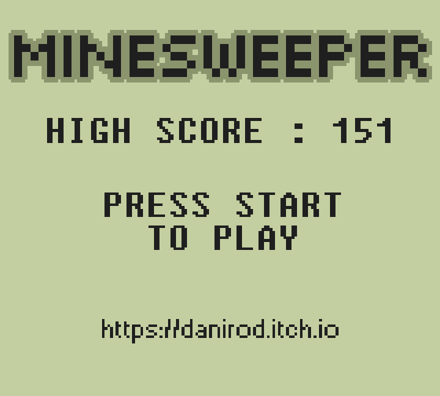
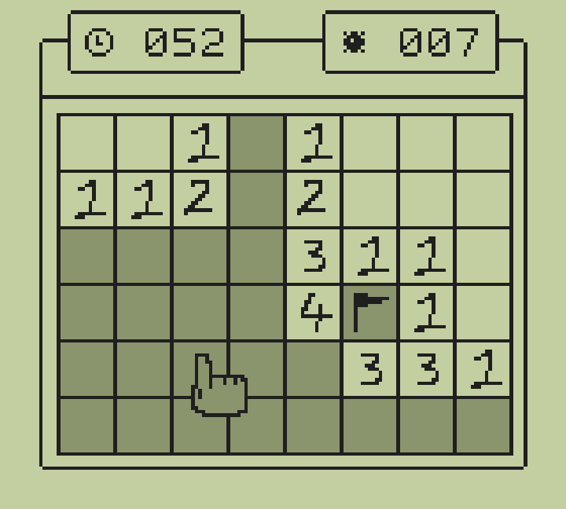
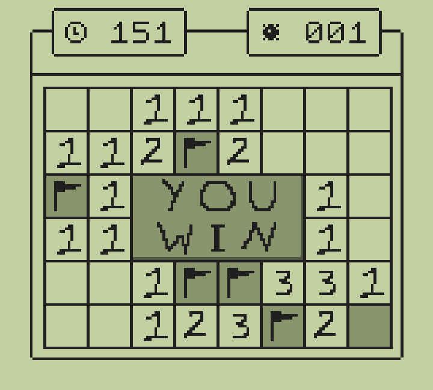

# minesweeper

I made a minesweeper, because why not.

# Images

To play the game, you can simply play in browser or download the GB file from my itch.io page: https://danirod.itch.io/minesweeper-gb

To build the game, you will need  to have GBDK installed and in your PATH, properly configured. Then you can build the game using

    make

The generated file will be in `obj/minesweeper.gb`.